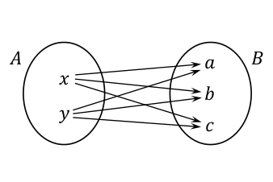
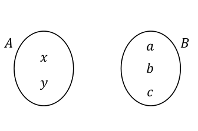
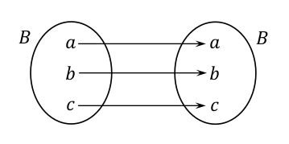

# Relazioni

***Una relazione $R$ tra l'insieme $A$ e l'insieme $B$ è un sottoinsieme del prodotto cartesiano $A \times B$***.

3 diversi tipi di notazione:

> $R \subseteq A \times B$

> $R \in Rel(A, B) Rel(A,B)= \mathcal{P(A \times B)}$

Dove Rel è l'insieme di tutte le relazioni tra A e B, ovvero l'insieme delle parti.

> $R: A \iff B$

Ad esempio, dato l'insieme $A = \{ a, b, c \}$ e l'insieme $B = \{ x, y \}$ alcuni esempi di relazione sono:
$R = \{(a, x); \ (b, y); \ (c, y)\} \subseteq A \times B$
$S = \{(y, c) \} \subseteq A \times B$
$\emptyset_{A, B} = \{ \} \subseteq A \times B$
Un qualsiasi sottoinsieme di $A \times B$ è una relazione tra $A \text{ e } B$.
Il più grande insieme di relazioni tra due insiemi è $A \times B$ .

Indicheremo *l'insieme di tutte le relazioni* tra $A$ e $B$ con la notazione $Rel(A, B)$.
Per indicare che $R$ è una relazione tra $A$ e $B$, ovvero $R \in Rel(A, B)$ scriveremo spesso $R: A \leftrightarrow B$

> $Rel(A, B) = \mathcal{P}(A \times B)$

l'insieme delle parti  $\mathcal{P}(A \times B)$ contiene tutti i sottoinsiemi del prodotto cartesiano $ A \times B$ e quindi tutt le possibili relazioni tra $A$ e $B$

> Se $A = \{x, y\}$ e $B = \{ a, b, c \}$ il sottoinsieme $\{ (x, a), (x, c) \}$ è una relazione in $Rel(A,B)$

Un esempio di relazione è quella di successore e si definisce così:
$\text{Succ}= \{ (x, y) \in \N \times \N \ | \ y = x + 1 \} \subseteq \N \times \N$
Da notare che l'insieme di partenza e l'insieme di arrivo sono gli stessi.

#### Alcuni tipi di relazione:

> Per tutti gli insiemi $A$ e $B$, il prodotto cartesiano $A \times B$ è una relazione in $Rel(A, B)$. Questa è anche detta RELAZIONE COMPLETA

- Relazione completa
  

> Per tutti gli insiemi $A$ e $B$, $\varnothing$ è una relazione in $Rel(A, B)$. Questa è anche detta RELAZIONE VUOTA e viene denotata con $\varnothing_{A,B}$

- Relazione vuota
  

> Per tutti gli insiemi $A$, $\{ \ (x, x) \ | \ x \in A \ \} \subseteq A \times A$ è una relazione ed è chiamata RELAZIONE IDENTITÀ

- Relazione identità
  

La realazione identità può anche essere vista come
$I = \{ (x, y) \in \R \times \R \ | \ x = y \}$
e quindi può essere vista graficamente come la bisettrice del primo e terzo quadrante.

La funzione identità è l' elemento neutro della composizione.

Talvolta l'insieme di partenza e di arrivo possono essere il prodotto cartesiano di altri insiemi:

$\text{Plus} =  \{ ((x, y), z) \in (\N \times \N) \times \N \ | \ z = x + y \} \in (\N \times \N) \times \N$

### Operazioni su relazioni

Come gli insiemi, anche le relazioni possono essere combinate in vari modi per ottenere nuove relazioni.

Ad esempio, data la relazione Madre e la relazione padre, l'unione di queste due relazione genera la relazione Genitore.

$\text{Madre} = \{ (x, y) \in \text{EU} \times \text{EU} \ | \ \text{x è madre di y} \}$
$\text{Padre} = \{ (x, y) \in \text{EU} \times \text{EU} \ | \ \text{x è padre di y} \}$
$\text{Madre} \cup \text{Padre} = \text{Genitore}$

quindi

$\text{Genitore} = \{ (x, y) \in \text{EU} \times \text{EU} \ | \text{x è madre di y oppure x è padre di y} \}$

Le leggi sulle relazioni sono uguali a quelle degli insiemi, ad eccezione che l'insieme universo adesso è il prodotto cartesiano.

- Composizione

Siano $R \subseteq A \times B$ e $S \subseteq B \times C$ (da notare che l'insieme di arrivo della relazione $R$ è l'insieme di partenza della relazione $S$), la composizione di $R$ con $S$ è la relazione:

> $ R; S= \{ (a, c) \in A \times C \ | \ \text{esiste almeno un elemento di } B \text{ tale che } (a, b) \in \R \ e \ (b, c) \in S \}$

L'insieme di partenza e l'insieme di arrivo non cambiano, sono fissati e restano uguali anche al termine della composizione.

Facciamo un esempio: che relazione è Padre;Genitore?

$ \text{Padre; Genitore} \subseteq \text{EU} \times \text{EU}$
$ \text{Padre; Genitore} = \{ (x, z) \ | \ \exist \ y \in \text{EU} \ | \ (x, y) \in \text{Padre e }  (y, z) \in \text{ Genitore} \}$
$ = \{ (x, z) \ | \ \text{ x è nonno di z} \} $

- Relazione opposta

> $R^{op} = \{ (y, x) \in B \times A \ | \ (x, y) \in R \ \}$

#### Quantificatori

$\exist a \in A \ | \ P(a)$ "Esiste almeno un a in A tale che P(a) è vera"
$\forall a \in A \ | \ P(a)$ "Per ogni a in A vale che P(a) è vera"

#### Proprietà di relazioni

- Totale
  Ogni elemento di A è mappato ***ad almeno*** un elemento di B.
- Univalente
  Ogni elemento di A è mappato ***al più*** a un elemento di B.
- Surgettiva
  Ogni elemento di B è l'immagine ***di almeno*** un elemento di A.
- Iniettiva
  Ogni elemento di B è l'immagine di ***al più*** un elemento di A.

|         | partenza   | arrivo     |
| ------- | ---------- | ---------- |
| almeno  | TOTALE     | SURGETTIVA |
| al più  | UNIVALENTE | INIETTIVA  |

CIAO