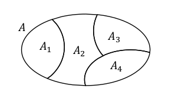

# Insiemi

Un insieme è una collezione di elementi. Insiemi uguali sono quelli con gli stessi elementi, anche se compaiono in ordine diverso. Due insiemi sono diversi se uno dei due insiemi contiene almeno un elemento che non appartiene all'altro.

Possono essere definiti in 2 modi

- Estensionale (enumerazione) es. $X = \{ a, b, c \} $
- Intensionale (per proprietà) es. $X = \{ x\ |\ P(x) \} $

## Leggi fondamentali per gli insiemi

#### Leggi per $\cup$ e $\cap$

$
Associatività \\
A \cup (B \cup C) = (A \cup B) \cup C \\
A \cap (B \cap C) = (A \cap B) \cap C
$

$
Unità \\
A \cup \emptyset = A \\
A \cap U = A
$

$
Commutatività \\
A \cup B = B \cup A \\ 
A \cap B = B \cap A
$

$
Idempotenza \\
A \cup A = A \\
A \cap A = A
$

$
Assorbimento \\
A \cup U = U \\
A \cap \emptyset = \emptyset
$

#### Leggi che collegano $\cup$, $\cap$ e $( )$**

$
Distributività\ di \cup su \cap \\
A \cup (B \cap C) = (A \cup B) \cap (A \cup C)
$

$
Distributività\ di \cap su \cup \\
A \cap (B \cup C) = (A \cap B) \cup (A \cap C)
$

#### Leggi di assorbimento

$
Assorbimento\ di \cup su \cap \\
A \cup (A \cap B) = A
$

$
Assorbimento\ di \cap su \cup \\
A \cap (A \cup B) = A
$

$
Complemento\ per\ \cup \\
A \cup A' = U
$

$
Complemento\ per\ \cap \\
A \cap A' = \emptyset
$

## Confrontare gli insiemi

Spesso è necessario dimostrare che due insiemi definiti in maniera diversa in realtà coincidono. Come già detto due insiemi sono uguali se contengono gli stessi elementi, indipendentemente dall'ordine o dalla molteplicità degli elementi.

> Due insiemi sono disgiunti de non hanno elementi in comune. Quindi se $A \cap B = \varnothing$

> A è sottoinsieme di B se ogni elemento di A è anche elemento di B. Si scrive $A \subseteq B$

> A è sottoinsieme proprio di B se A è sottoinsieme di B e A $\neq$ B. Si scrive $A \subset B$

> Per dimostrare che A = B si dimostra che $A \subseteq B$ e che $B \subseteq A$

Per confrontare gli insiemi si possono usare 3 tipi di dimostrazione:

- Con i diagrammi di Eulero-Venn
- Dimostrazioni per sostituzione
- Dimostrazioni discorsive

Dimostrazione discorsiva di uguaglianza tra 2 insiemi

$ \overline{A \cup B} \subseteq \overline{A}\ \cap \ \overline{B} $
quindi, dalla definizione di complemento abbiamo che:
$ x \notin A \cup B $
dalla def di unione abbiamo che:
$ x \notin A \ e \ x \notin B $
quindi $x \in \overline{A}$ e $x \in \overline{B}$
per la definizione di intersezione
$x \in \overline{A} \cap \overline{B}$

ACHTUNG
$\overline{A} \cup \overline{B} = U ?$
*no, il risultato è $U \cup (A \cap B)$*

Continuo la dimostrazione discorsiva
$ \overline{A} \cap \overline{B} \subseteq  \overline{A \cup B} $
x appartiene all'insieme universo ad eccezione degli insiemi A e B.
$ x \notin A $ e $x \notin B$
$ x \notin A \cup B $
$ x \in \overline{A \cup B} $

Fine dimostrazione

### Proprietà delle relazioni sugli insiemi

#### Proprietà dell'uguaglianza

Per tutti gli insiemi $A, B, C$ vale che:

- $ A = A \text{ (riflessività)} $
- $ \text{Se } A = B \text{ e } B = C \text{, allora } A = C \text{ (transitività)} $
- $ \text{Se } A = B \text{ allora } B = A \text{ (simmetria)}

#### Proprietà dell'inclusione

Per tutti gli insiemi $A, B, C$ vale che:

- $ A \subseteq A \text{ (riflessività)} $
- $ \text{Se } A \subseteq B \text{ e } B \subseteq C \text{, allora } A \subseteq C \text{ (transitività)} $
- $ \text{Se } A \subseteq B \text{ e } B \subseteq A \text{, allora } A = B \text{ (anti-simmetria)} $

## Insiemi di insiemi

Alcuni problemi richiedono di investigare tutte le possibili combinazioni degli elementi in un insieme. In questo caso è utile trattare insiemi i cui elementi siano a loro volta altri insiemi, ad esempio:

$\{ \{ 2, 4, 6, 8 \}, \{ 1, 3, 5, 7, 9 \}  \}$

## Insieme delle parti

Dato un insieme A, Il suo insieme delle parti $\mathcal{P} (A)$ è l'insieme composto da tutti i possibili sottoinsiemi di $A$.

> $\mathcal{P}(A) = \{\ X\ |\ X \subseteq A \ \} $

ad esempio, dato un insieme $A = \{\ a,\ b,\ c\ \}$ il suo insieme delle parti è:

$\mathcal{P} (A) = 
\{ 
\{ \varnothing \}, 
\{ a \},
\{ b \},
\{ c \},
\{ a, b \},
\{ a, c \},
\{ b, c \},
\{ a, b, c \}
\}$

> per tutti gli insiemi $A$ vale che $ \varnothing \in \mathcal{P}(a)$ e $ A \in \mathcal{P}(A)$

La cardinalità dell'insieme delle parti è composto sempre da $2^n$ sottoinsiemi

> $ |\mathcal{P}(A)| = 2^{|a|} $

## K-insiemi

Sono tutti gli insiemi delle parti con cardinalità k di un certo insieme A

> $\mathcal{P}(A)_k = \{\ X \subseteq A\ |\ |X|=k   \}$

## Famiglie di insiemi

Sia $I$ un insieme tale che per ogni $i \in I$ sia definito un certo insieme $A_i$. L'insieme $\mathcal{F}$ che ha come elementi tutti gli insiemi $A_i$ viene detta FAMIGLIA INDICIZZATA DA $I$

> $\mathcal{F}=\{ A_i\ |\ i \in I \} = \{ A_i \}_{i \in I}$

Formalmente la famiglia può anche essere vista come una tripletta

> $ (X, I, \iota)\ con\ X\ e\ I\ insiemi\ e\ \iota\ una\ funzione\ suriettiva\ \iota: I \rightarrow X  $

$
I = \{ 1991, 1996, 2001, 1983 \} \\
A = \{ Andrea,\ Gaetano,\ Simone,\ Martina,\ Roberta\  \}\\
\iota = funzione\ che\ associa\ ogni\ anno\ all'\ insieme\ delle\ persone\ nate\ in\ quell'\ anno.
$

$
\iota(1991) = A_{1991} = \{ Andrea,\ Simone \} \\
\iota(1996) = A_{1996} = \{ Gaetano \} \\
\iota(2001) = A_{2001} = \{ Martina \} \\
\iota(1983) = A_{1983} = \varnothing
$

$
\mathcal{F}=\{ \{ Andrea,\ Simone \}, \{ Gaetano \}, \{ Martina \}, \varnothing \}
$

## Partizioni

Sono particolari famiglie di insieme che partizionano gli elementi di un certo insieme A in sottoinsiemi separati (disgiunti).

### Proprietà:

> Ogni insieme $A_i$ è diverso da $\varnothing$ (insiemi non vuoti)

> $\cup_{i \in I} A_i = A$ (copertura di A, l'unione degli insiemi dà proprio A)

> Presi due indici qualsiasi $i$ e $j$ con $i \neq j$ si ha sempre che $A_i \cap A_j = \varnothing$ (insiemi disgiunti)

Esempio: un insieme di persone può essere partizionato in base all'anno di nascita di ciascuna persona.

## Prodotto cartesiano

Gli insiemi collezionani elementi in maniera non ordinata ma a volte sarebbe utile rappresentare collezioni ordinate (insiemi ordinati) per rappresentare, ad esempio, stringhe o vettori:

$(a_1, a_2, a_3, ... , a_n)$

Ovviamente vorremmo che le coppie ordinate $(a, b)$ e $(b, a)$ siano ritenute diverse, mentre sappiamo che $\{ a, b\} = \{ b, a\}$

> Siano $A$ e $B$ due insiemi. Il PRODOTTO CARTESIANO di $A$ per $B$ scritto $A \times B$ è l'insieme formato da tutte e sole le coppie ordinate $(a, b)$ tali che $a \in A$ e $b \in B$

In formule:

> $A \times B = \{ \ (a, b)\ | \ a \in A,\ b \in B\ \}$

Ad esempio l'insieme $\R \times \R$ è l'insieme delle coppie $(x, y)$ tale che $x, y \in \R$. Solitamente tale insieme viene rappresentato con dei punti in in piano ed è chiamato PIANO CARTESIANO.

## Cardinalità

Ci riferiamo a insiemi finiti, la cardinalità indica il numero di elementi appartenenti a un insieme.

> $|A| = n$
